# 🌌 EcoTrack - Household Resource Tracker

EcoTrack is a premium, full-stack web application designed to help households monitor and manage their consumption of vital resources like **Electricity, Water, and Gas**. With a focus on modern aesthetics and real-time analytics, EcoTrack empowers users to reduce their carbon footprint and save on utility costs.

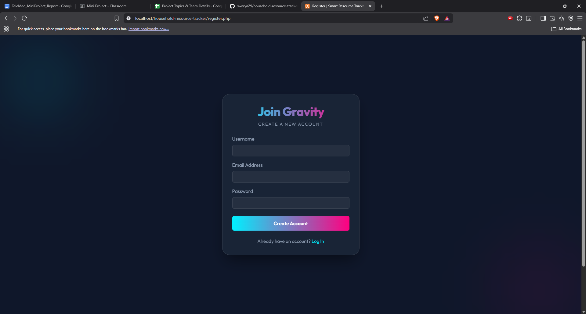
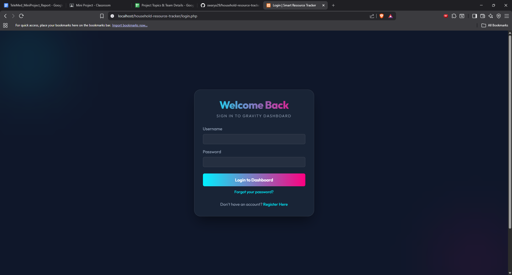

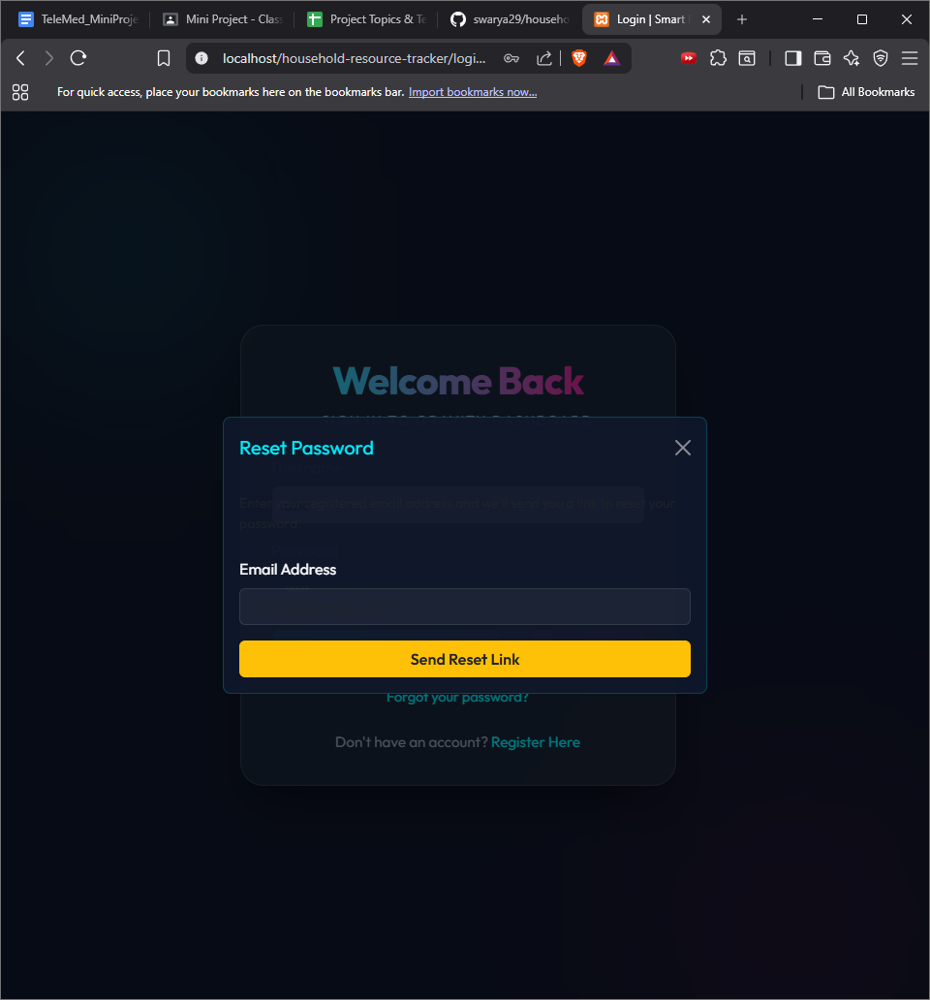
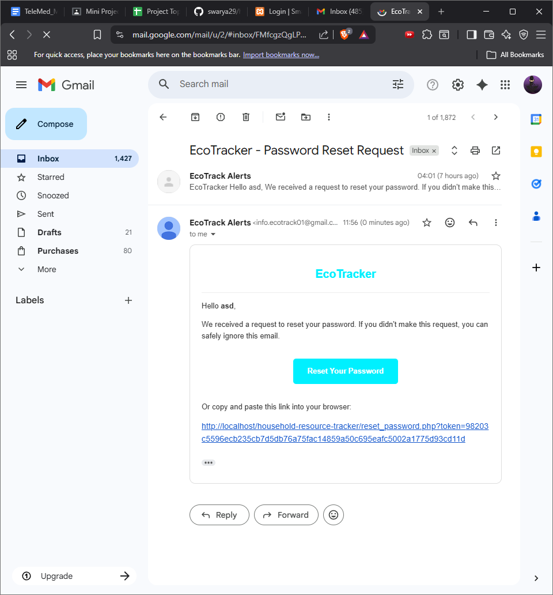
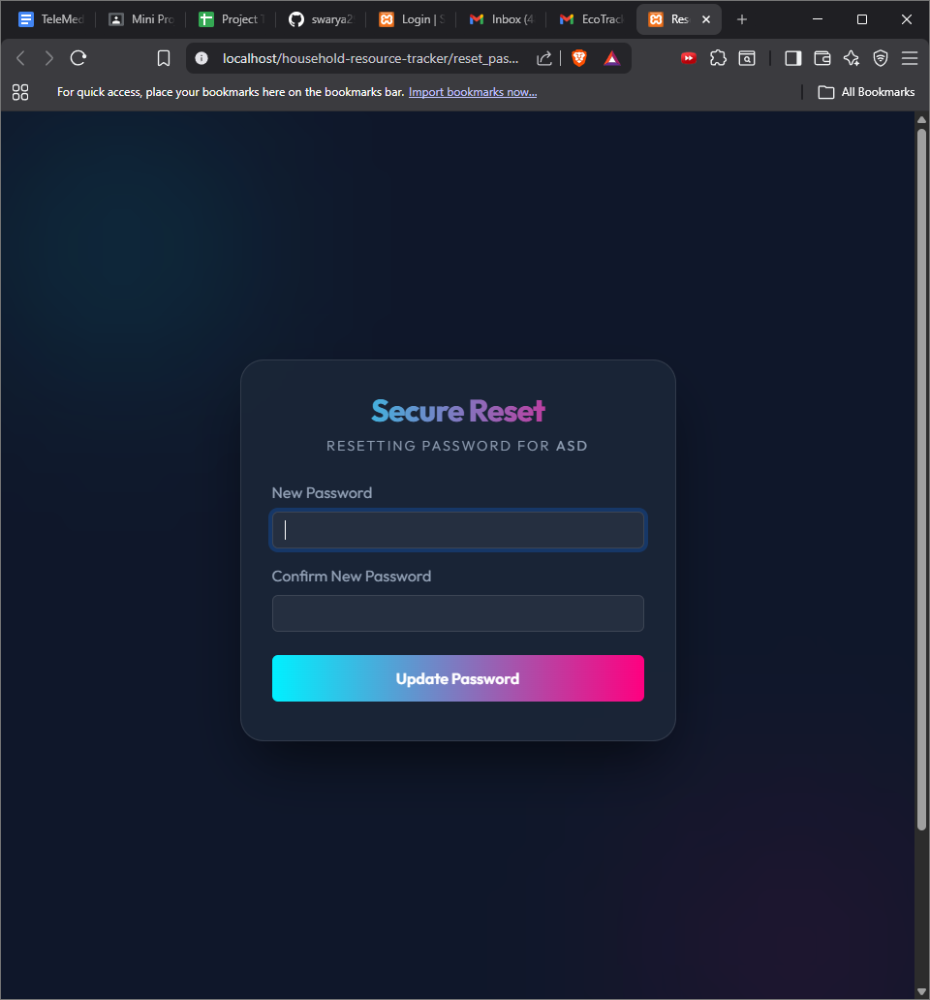
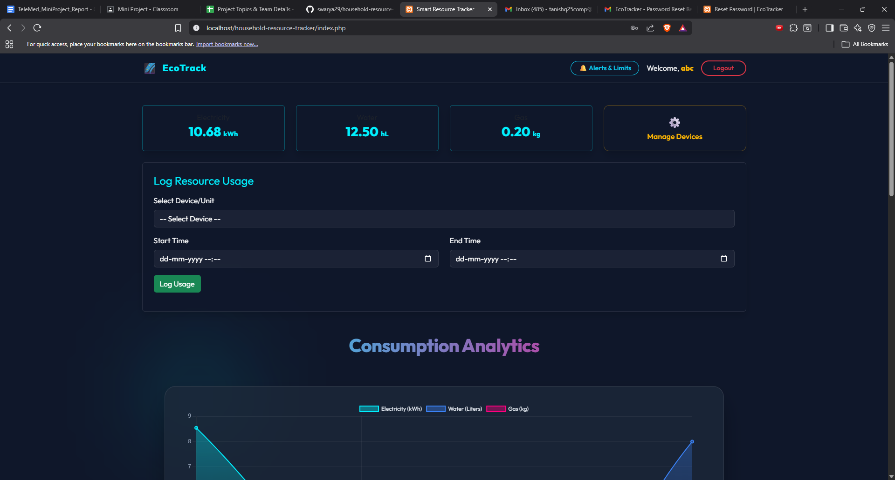
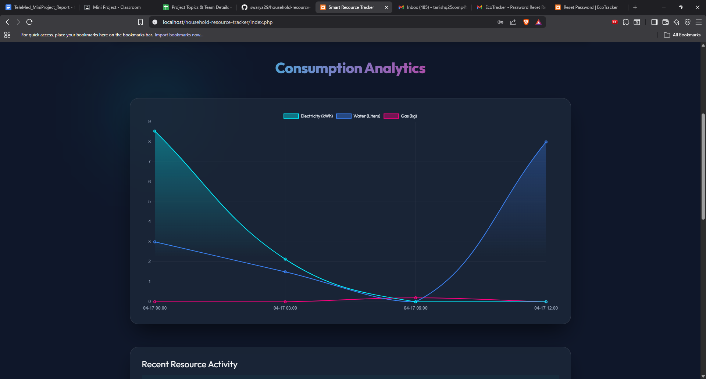
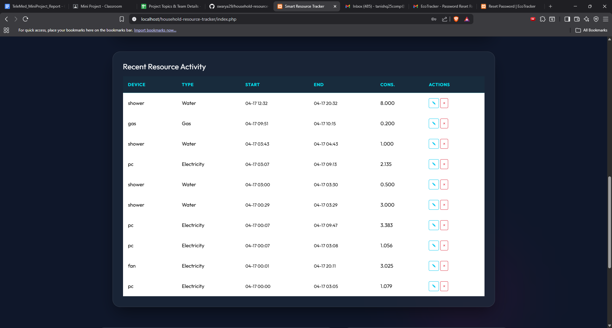
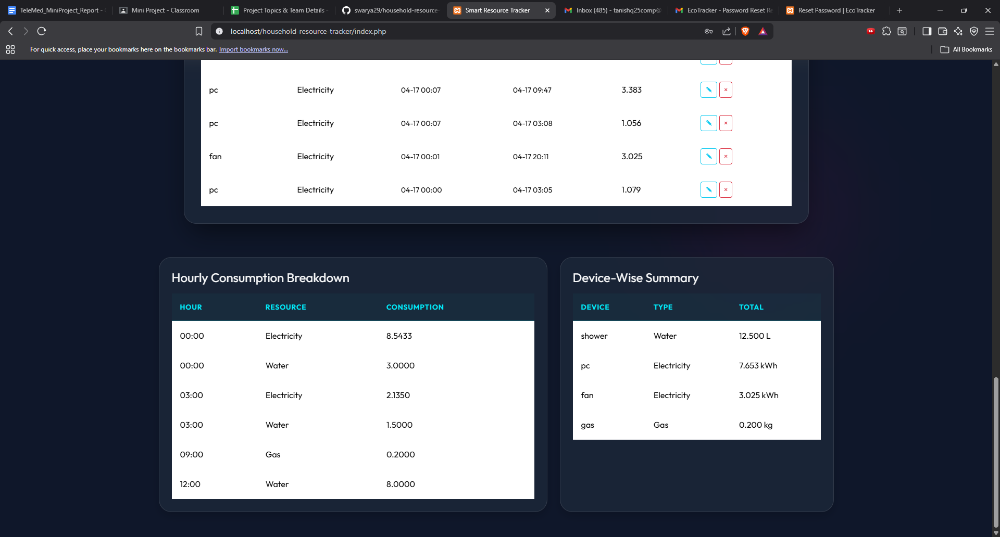
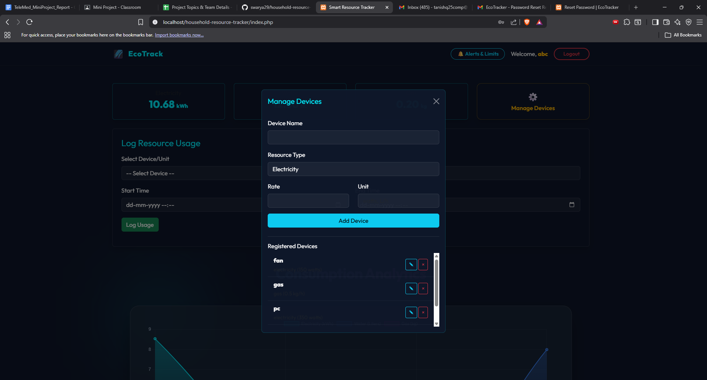
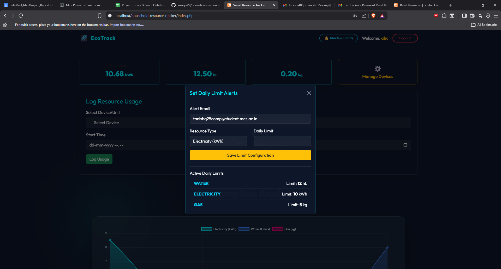   
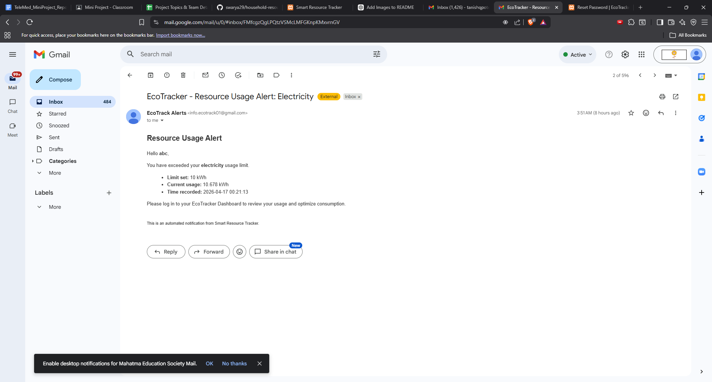
## 🚀 Key Features

- **📊 Dynamic Consumption Analytics**: Visualize your resource usage over time with high-fidelity, interactive charts powered by Chart.js.
- **🔌 Device-Level Monitoring**: Register individual household devices (appliances, faucets, etc.) and track their specific consumption based on custom rates.
- **🔔 Smart Alerts & Limits**: Set daily consumption thresholds for each resource type and receive automated email notifications when you exceed them.
- **🕒 Detailed History**: Access comprehensive hourly breakdowns and recent activity logs to identify usage peaks.
- **🔐 Secure User Management**: Robust authentication system with JWT-based sessions, secure registration, and email-based password recovery.
- **✨ Premium UI/UX**: A state-of-the-art "Gravity" dark theme with glassmorphism, smooth animations, and a responsive mobile-first design.

## 🛠️ Tech Stack

- **Backend**: PHP 8.x (RESTful API architecture)
- **Frontend**: HTML5, Vanilla JavaScript (Fetch API), CSS3 (Custom Gravity Framework)
- **Design Framework**: Bootstrap 5.3 + Custom Styling
- **Visualization**: Chart.js
- **Database**: MySQL / MariaDB
- **Emailing**: PHPMailer

## 📋 Prerequisites

Before you begin, ensure you have the following installed:
- [XAMPP](https://www.apachefriends.org/index.html) or any PHP & MySQL environment.
- [Composer](https://getcomposer.org/) (for PHPMailer dependencies).

## ⚙️ Installation & Setup

1. **Clone the Repository**
   ```bash
   git clone https://github.com/swarya29/household-resource-tracker.git
   cd household-resource-tracker
   ```

2. **Database Configuration**
   - Open phpMyAdmin or your SQL client.
   - Create a new database named `resource_tracker`.
   - Import the `resource_tracker.sql` file provided in the root directory.

3. **Environment Variables**
   - Rename `.env.example` to `.env`.
   - Update the database credentials and SMTP settings for the alert engine:
     ```env
     DB_HOST=localhost
     DB_NAME=resource_tracker
     DB_USER=root
     DB_PASS=
     
     # SMTP Settings (for PHPMailer)
     SMTP_HOST=smtp.gmail.com
     SMTP_USER=your-email@gmail.com
     SMTP_PASS=your-app-password
     SMTP_PORT=587
     ```

4. **Install Dependencies**
   - Run the following command to install PHPMailer:
     ```bash
     php install_phpmailer.php
     ```

5. **Run the Application**
   - Move the project folder to `xampp/htdocs`.
   - Start Apache and MySQL from the XAMPP Control Panel.
   - Open your browser and navigate to `http://localhost/household-resource-tracker`.

## 📂 Project Structure

- `/api`: Core logic, endpoints (devices, logs, limits), and the alert engine.
- `/assets`: UI assets and previews.
- `index.php`: The main dashboard and analytics hub.
- `gravity.css`: The custom design system powering the application's unique look.
- `/vendor`: PHPMailer and other dependencies (generated after installation).

## 🛡️ Security

EcoTrack implements several security best practices:
- **Prepared Statements**: Protection against SQL Injection.
- **Input Sanitization**: Cleansing of all user-submitted data.
- **Session Management**: Secure, server-side session handling.
- **Environment Isolation**: Sensitive configuration stored in `.env`.

## 👥 Contributors

- **Swarya Patil CEB 446**: Project Lead & Backend Architecture. Responsible for the core system design and logic.
- **Ishan Pishordy CEB 450**: API Developer. Developed the asynchronous REST endpoints and calculation engines.
- **Tanishq Pote CEB 451 **: Frontend & UI Designer. Created the custom "Gravity" theme and interactive dashboard components.
- **Adarsh ThayilCEB 467**: Database & Security. Managed DB schema design and implemented security best practices.

---

Developed with ❤️ for a sustainable future.
